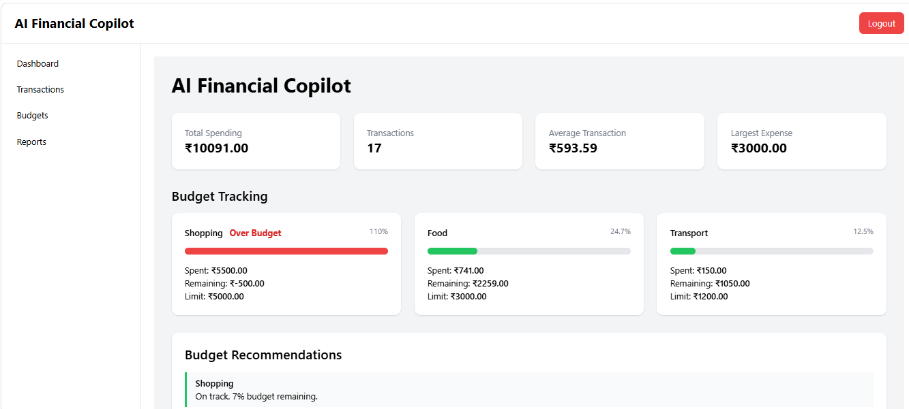
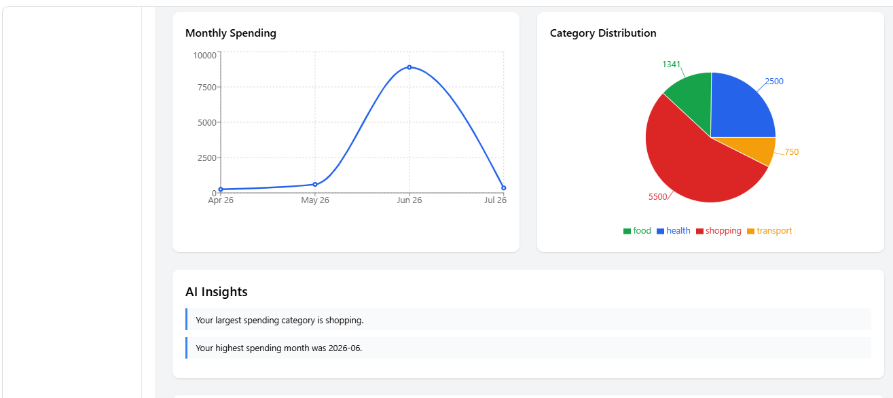
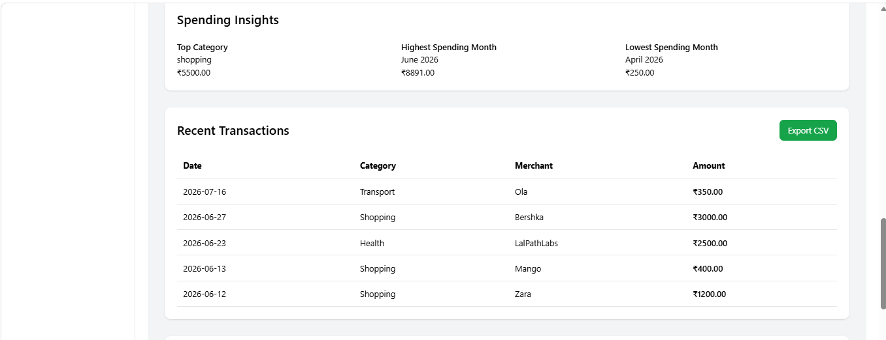
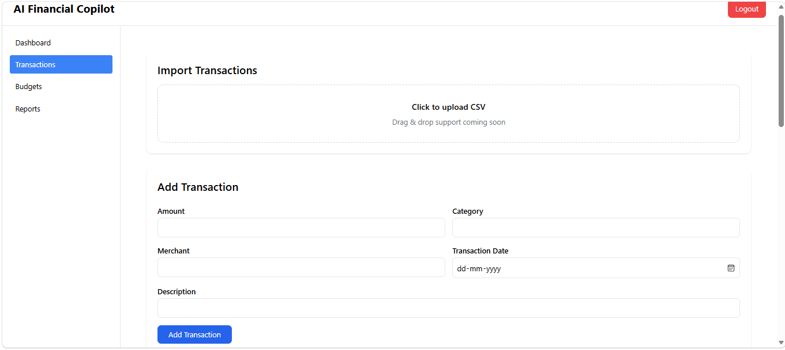
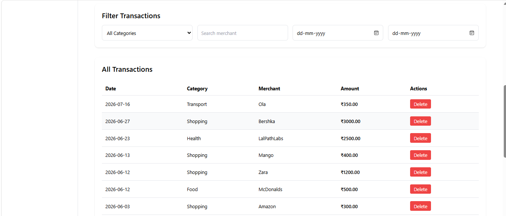
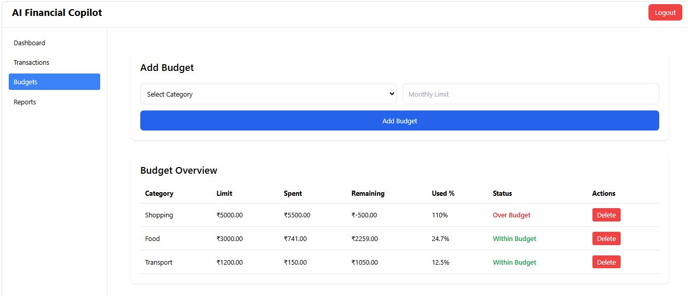
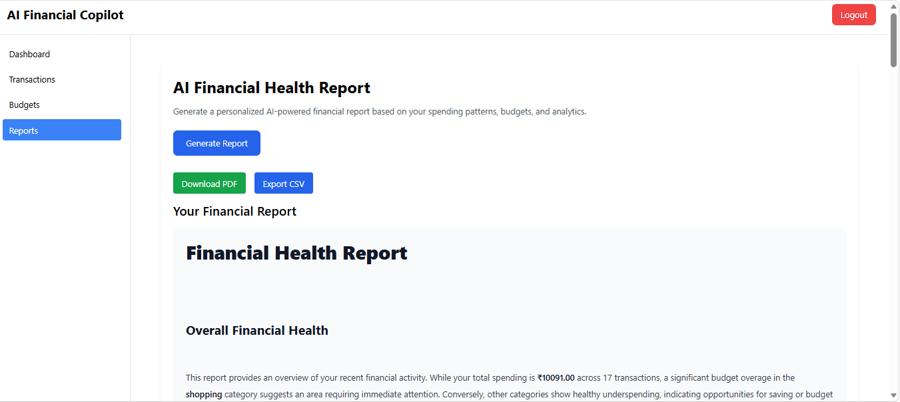

# AI Financial Copilot

AI Financial Copilot is a full-stack personal finance application that helps users manage expenses, track budgets, visualize spending patterns, and receive AI-powered financial insights and recommendations.

## Live Demo

Frontend: https://ai-financial-copilot-phi.vercel.app
Backend: https://ai-financial-copilot-kw4t.onrender.com/docs

## Features

### Authentication
- User registration and login
- JWT-based authentication
- Protected routes
### Transaction Management
- Add, view, and delete transactions
- CSV transaction import
- Export transactions to CSV
### Budget Management
- Create monthly budgets by category
- Track spending against budgets
- Budget utilization progress bars
- Smart budget recommendations
### Analytics Dashboard
- Total spending summary
- Monthly spending trends
- Category-wise spending breakdown
- Highest and lowest spending months
- Top spending category
### AI Features
- AI-powered financial assistant chat
- Personalized financial health reports
- Spending insights and recommendations
- Persistent chat history
### Reports
- Generate AI financial reports
- Export reports as PDF

## Tech Stack

### Backend
- FastAPI
- SQLAlchemy
- PostgreSQL
- Alembic
- JWT Authentication

### Frontend
- React
- Vite
- Tailwind CSS
- Recharts
- Axios

### Deployment
- Frontend: Vercel
- Backend: Render
- Database: Neon PostgreSQL

## Screenshots

## Dashboard

## Transactions

## Budget Management

## AI Financial Report

## AI Chat Assistant

## Setup

### Backend

cd backend
pip install -r requirements.txt
uvicorn app.main:app --reload

### Frontend

cd frontend
npm install
npm run dev

## Environment Variables

Create a `.env` file:

OPENAI_API_KEY=
DATABASE_URL=
SECRET_KEY=

## Future Improvements
- Email notifications for budget alerts
- Recurring transaction support
- Dark mode
- OCR-based receipt scanning
- Advanced forecasting models
